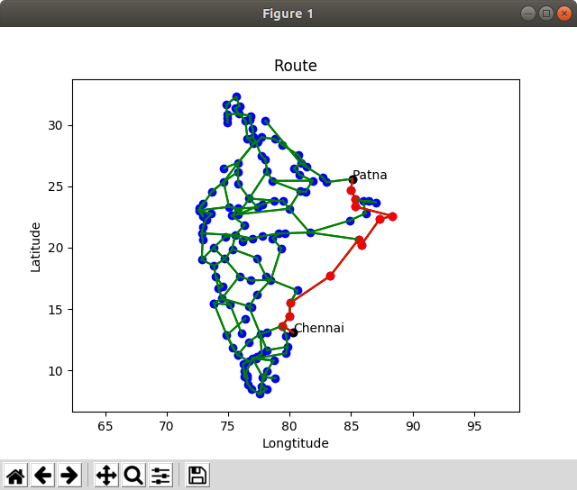

# Домашняя работа 2
Леонов Алексей, 165 группа.

В реализации используется библиотека matplotlib.
Устанавливается командной:

sudo pip3 install matplotlib

### Запуск программы:

python3 src/main.py [-h] [-t TOPOLOGY] [-r] [-s SOURCE_NODE] [-d DEST_NODE] [-v]

### Пример работы:

python3 src/main.py -t maps/TataNld.graphml -s 10 -d 50 -v

